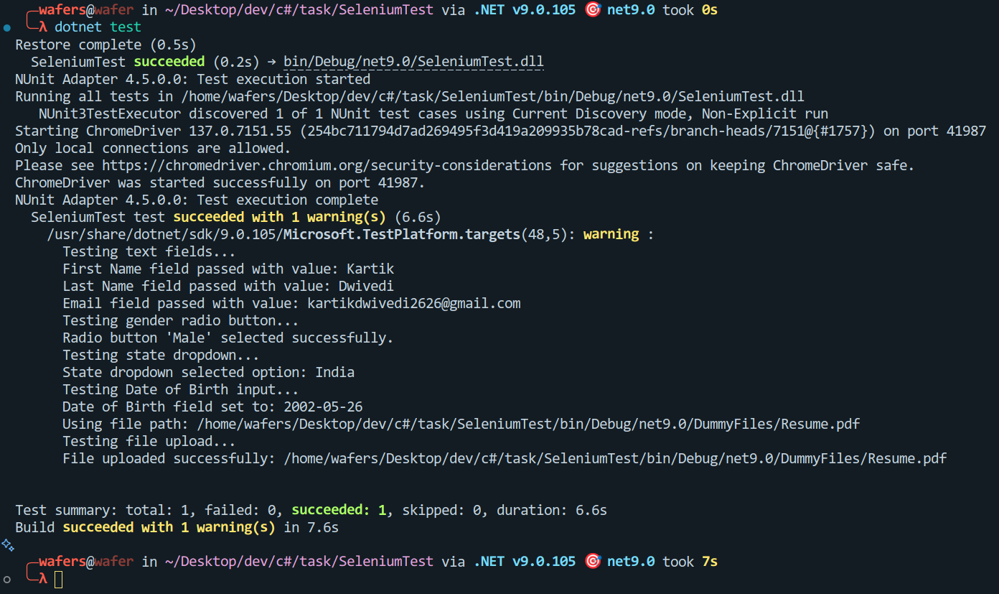

# Automated Web Form Testing


This repository contains an automated Selenium test suite built with C# and NUnit, designed to test a web form hosted at `http://app.cloudqa.io/home/AutomationPracticeForm`.

## Features

- Tests text input fields with resilient assertions.
- Selects gender radio button.
- Selects state from dropdown.
- Inputs date of birth.
- Uploads a file (Resume.pdf) using Selenium's file upload functionality.
- Uses headless ChromeDriver for running tests.

## Project Structure

    Root_Directory/
    ├── DummyFiles/
    ├── Public/
    │   └── test_run_screenshot.png
    ├── FormTests.cs
    ├── SeleniumTest.csproj
    ├── SeleniumTest.sln
    ├── setup_chromedriver.sh
    ├── .gitignore
    └── README.md


## Prerequisites

- [.NET 9 SDK](https://dotnet.microsoft.com/download/dotnet/9.0)
- [Google Chrome](https://www.google.com/chrome/)
- ChromeDriver matching your Chrome version

## Setup

1. Clone the repo:
   ```bash
   git clone <repo-url>
   cd SeleniumTest
    ```

2. Make the ChromeDriver executable by running:
   ```bash
   chmod +x setup_chromedriver.sh
   ./setup_chromedriver.sh
   ```

3. Restore dependencies and build the project:
   ```bash
   dotnet restore
   dotnet build
   ```

4. Run the tests:
   ```bash
   dotnet test
   ```
## Running Tests
To run the tests, ensure you have the ChromeDriver set up and then execute the following command in your terminal:

```bash
dotnet test
```
## Notes   
- Ensure that the `DummyFiles/Resume.pdf` file exists in the specified directory.
- The file DummyFiles/Resume.pdf is copied automatically to the build output directory and used for the file upload test.
- The project uses implicit and explicit waits for element resilience.
- The tests are designed to run in headless mode, which means they won't open a browser window. If you want to see the browser actions, you can modify the `SeleniumTest.cs` file to remove the headless option.
- The tests are resilient to minor changes in the form, such as field order or additional fields, as long as the essential fields remain present.
- `setup_chromedriver.sh` grants execution permission to the chromedriver binary if included in the repo.

## Test Run Output

Below is a screenshot of the console output after running the tests successfully:



### Detailed Logs

When you run the tests, you will see detailed logs in the console output similar to the following:

```plaintext
    ╭─wafers@wafer in ~/Desktop/dev/c#/task/SeleniumTest via .NET v9.0.105 🎯 net9.0 took 7s
    ╰─λ dotnet test --logger:"console;verbosity=detailed"
    Restore complete (0.5s)
    SeleniumTest succeeded (0.2s) → bin/Debug/net9.0/SeleniumTest.dll
    A total of 1 test files matched the specified pattern.
    /home/wafers/Desktop/dev/c#/task/SeleniumTest/bin/Debug/net9.0/SeleniumTest.dll
    NUnit Adapter 4.5.0.0: Test execution started
    NUnit Adapter 4.5.0.0: Test execution started
    Running all tests in /home/wafers/Desktop/dev/c#/task/SeleniumTest/bin/Debug/net9.0/SeleniumTest.dll
    Running all tests in /home/wafers/Desktop/dev/c#/task/SeleniumTest/bin/Debug/net9.0/SeleniumTest.dll
    NUnit3TestExecutor discovered 1 of 1 NUnit test cases using Current Discovery mode, Non-Explicit run
    NUnit3TestExecutor discovered 1 of 1 NUnit test cases using Current Discovery mode, Non-Explicit run
    Starting ChromeDriver 137.0.7151.55 (254bc711794d7ad269495f3d419a209935b78cad-refs/branch-heads/7151@{#1757}) on port 32999
    Starting ChromeDriver 137.0.7151.55 (254bc711794d7ad269495f3d419a209935b78cad-refs/branch-heads/7151@{#1757}) on port 32999
    Only local connections are allowed.
    Only local connections are allowed.
    Please see https://chromedriver.chromium.org/security-considerations for suggestions on keeping ChromeDriver safe.
    Please see https://chromedriver.chromium.org/security-considerations for suggestions on keeping ChromeDriver safe.
    ChromeDriver was started successfully on port 32999.
    ChromeDriver was started successfully on port 32999.
    Testing text fields...
    First Name field passed with value: Kartik
    Last Name field passed with value: Dwivedi
    Email field passed with value: kartikdwivedi2626@gmail.com
    Testing gender radio button...
    Radio button 'Male' selected successfully.
    Testing state dropdown...
    State dropdown selected option: India
    Testing Date of Birth input...
    Date of Birth field set to: 2002-05-26
    Using file path: /home/wafers/Desktop/dev/c#/task/SeleniumTest/bin/Debug/net9.0/DummyFiles/Resume.pdf
    Testing file upload...
    File uploaded successfully: /home/wafers/Desktop/dev/c#/task/SeleniumTest/bin/Debug/net9.0/DummyFiles/Resume.pdf

    NUnit Adapter 4.5.0.0: Test execution complete
    NUnit Adapter 4.5.0.0: Test execution complete
    Passed TestFormFieldsResiliently [5 s]
    Standard Output Messages:
    Testing text fields...
    First Name field passed with value: Kartik
    Last Name field passed with value: Dwivedi
    Email field passed with value: kartikdwivedi2626@gmail.com
    Testing gender radio button...
    Radio button 'Male' selected successfully.
    Testing state dropdown...
    State dropdown selected option: India
    Testing Date of Birth input...
    Date of Birth field set to: 2002-05-26
    Using file path: /home/wafers/Desktop/dev/c#/task/SeleniumTest/bin/Debug/net9.0/DummyFiles/Resume.pdf
    Testing file upload...
    File uploaded successfully: /home/wafers/Desktop/dev/c#/task/SeleniumTest/bin/Debug/net9.0/DummyFiles/Resume.pdf


    Test Run Successful.
    Total tests: 1
        Passed: 1
    Total time: 5.9000 Seconds
    SeleniumTest test succeeded with 1 warning(s) (6.1s)
        /usr/share/dotnet/sdk/9.0.105/Microsoft.TestPlatform.targets(48,5): warning : 
        Testing text fields...
        First Name field passed with value: Kartik
        Last Name field passed with value: Dwivedi
        Email field passed with value: kartikdwivedi2626@gmail.com
        Testing gender radio button...
        Radio button 'Male' selected successfully.
        Testing state dropdown...
        State dropdown selected option: India
        Testing Date of Birth input...
        Date of Birth field set to: 2002-05-26
        Using file path: /home/wafers/Desktop/dev/c#/task/SeleniumTest/bin/Debug/net9.0/DummyFiles/Resume.pdf
        Testing file upload...
        File uploaded successfully: /home/wafers/Desktop/dev/c#/task/SeleniumTest/bin/Debug/net9.0/DummyFiles/Resume.pdf
        

    Test summary: total: 1, failed: 0, succeeded: 1, skipped: 0, duration: 6.1s
    Build succeeded with 1 warning(s) in 7.1s
```